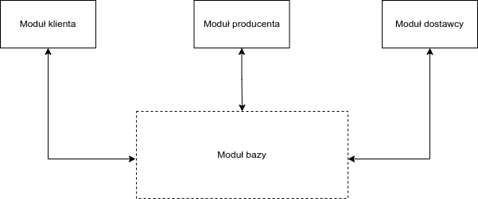
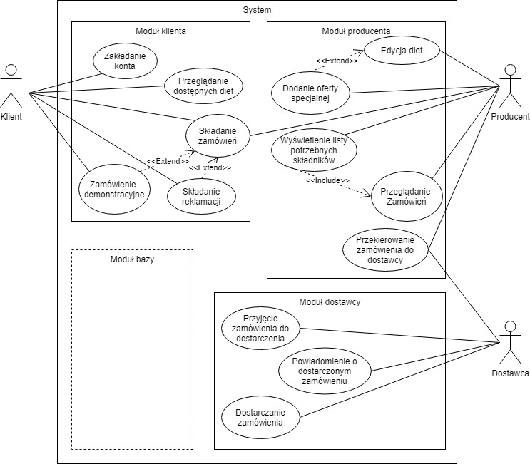

# Opis systemu

## Cele i koncepcja

Projektowany system ma służyć do obsługi kateringu dietetycznego. Klient
otrzymuje możliwość złożenia zamówienia na dietę na wybrany przedział
czasowy. Następnie będzie mógł śledzić stan zamówienia i składać
reklamacje dotyczące zamówienia. Producent otrzymuje możliwość
przetwarzania zamówień oraz reklamacji złożonych przez klienta. Dostawca
otrzymuje możliwość przetwarzania zamówień przeznaczonych do
dostarczenia oraz powiadamiania użytkowników o wykonanej dostawie. Na
podstawie tej koncepcji można wyróżnić cztery moduły, które zawiera
projektowane oprogramowanie.

## Moduły systemu

  - Moduł klienta

  - Moduł producenta

  - Moduł dostawcy

  - Moduł bazy

Podział na moduł klienta, producenta i dostawcy wynika ze specyfikacji
systemu. Dostęp do każdego z modułów uzyskiwany jest poprzez logowanie
do konta o przypisanej roli. Każdy moduł połączony jest z modułem bazy
danych, który obsługuje żądania odpowiadające funkcjom CRUD. Na
poniższym diagramie przedstawiony został schemat połączeń między
modułami systemu.



## Historyjki użytkowników

Historyjkom użytkownika przypisujemy priorytety metodą MoSCoW. Tak
zhierarchizowana lista stanowi swoisty wyznacznik wymagań, które będzie
spełniała aplikacja.

<div id="tab:table-name">

| Jako...   | Chcę...                               | Aby...                   | MoSCoW |
| :-------- | :------------------------------------ | :----------------------- | :----- |
| Klient    | założyć konto,                        | składać zamówienia.      | Must   |
| Klient    | przeglądać dostępne diety,            | wybrać najlepszą ofertę. | Must   |
| Klient    | składać zamówienia.                   |                          | Must   |
| Klient    | skorzystać z oferty demonstracyjnej,  | móc wypróbować ofertę.   | Could  |
| Klient    | składać reklamcje.                    |                          | Should |
| Producent | edytować diety w ofercie,             | udostępnić menu.         | Must   |
| Producent | dodawać oferty specjalne.             |                          | Won’t  |
| Producent | widzieć listę potrzebnych składników, | zaplanować zakupy.       | Should |
| Producent | przeglądać zamówienia.                |                          | Must   |
| Producent | przekierować zamówienie do dostawcy.  |                          | Must   |
| Dostawca  | przetwarzać zamówienia,               | móc je realizować.       | Must   |
| Dostawca  | wysłać potwierdzenie do użytkownika.  |                          | Should |

</div>

## Diagram przypadków użycia

Korzystając z powyższej listy historyjek użytkowników prezentujemy
diagram przypadków użycia, który pozwoli nam zobrazować relacje między
nimi, a także funkcjonalności dostępne dla poszczególnych klas
użytkowników w wyszczególnionych modułach.



## Kluczowe funkcjonalności

Aby w większym stopniu zrozumieć docelowe mechanizmy działania systemu,
opisujemy trzy kluczowe funkcjonalności przy pomocy tabel.
Wyszczególniamy ich warunki, wyjątki i procedury.

### Składanie zamówienia

<div id="tab:table-name">

<table>
<caption>
<span id="tab:table-name" label="tab:table-name">
Kluczowa funkcjonalność - składanie zamówienia.
</span>
</caption>
<thead>
<tr class="header">
<th style="text-align: left;">Nazwa</th>
<th style="text-align: left;">Składanie zamówienia</th>
</tr>
</thead>
<tbody>
<tr class="odd">
<td style="text-align: left;">Krótki opis</td>
<td style="text-align: left;">Klient zamawia dietę na określony czas.</td>
</tr>
<tr class="even">
<td style="text-align: left;">Warunek wstępny</td>
<td style="text-align: left;">Użytkownik jest zalogowany jako klient.</td>
</tr>
<tr class="odd">
<td style="text-align: left;">Warunek końcowy</td>
<td style="text-align: left;">Zamówienie jest złożone.</td>
</tr>
<tr class="even">
<td style="text-align: left;">Potencjalne wyjątki</td>
<td style="text-align: left;">Klient nie kończy transakcji.</td>
</tr>
<tr class="odd">
<td style="text-align: left;">Stan systemu po wyjątku</td>
<td style="text-align: left;">Zamówienie nie zostaje złożone.</td>
</tr>
<tr class="even">
<td style="text-align: left;">Aktorzy</td>
<td style="text-align: left;">Klient</td>
</tr>
<tr class="odd">
<td style="text-align: left;">Wyzwalacz</td>
<td style="text-align: left;">Klient chce zamówić dietę.</td>
</tr>
<tr class="even">
<td style="text-align: left;">Standardowa procedura</td>
<td style="text-align: left;"><ol>
<li><p>Klient wybiera dietę.</p></li>
<li><p>Klient wybiera okres na który zamawia dietę.</p></li>
<li><p>Klient podaje adres dostawy oraz sposób płatności.</p></li>
<li><p>Klient dokonuje płatności.</p></li>
<li><p>Klient otrzymuje potwierdzenie złożenia zamówienia.</p></li>
</ol></td>
</tr>
<tr class="odd">
<td style="text-align: left;">Alternatywne procedury</td>
<td style="text-align: left;">1’-4’ Klient anuluje zamówienie. Zamówienie nie zostaje złożone. ’ System zgłasza niepowodzenie płatności ’ Zamówienie nie zostaje złożone</td>
</tr>
</tbody>
</table>

</div>

### Zarządzanie ofertą przez producenta

<div id="tab:table-name">

<table>
<caption>
<span id="tab:table-name" label="tab:table-name">
Kluczowa funkcjonalność - edycja oferty.
</span>
</caption>
<thead>
<tr class="header">
<th style="text-align: left;">Nazwa</th>
<th style="text-align: left;">Zarządzanie ofertą przez producenta</th>
</tr>
</thead>
<tbody>
<tr class="odd">
<td style="text-align: left;">Krótki opis</td>
<td style="text-align: left;">Producent dodaje, usuwa lub modyfikuje ofertę.</td>
</tr>
<tr class="even">
<td style="text-align: left;">Warunek wstępny</td>
<td style="text-align: left;">Producent jest zalogowany na swoje konto.</td>
</tr>
<tr class="odd">
<td style="text-align: left;">Warunek końcowy</td>
<td style="text-align: left;">Zmiany zostały wprowadzone.</td>
</tr>
<tr class="even">
<td style="text-align: left;">Potencjalne wyjątki</td>
<td style="text-align: left;">Anulowanie dokonanych zmian.</td>
</tr>
<tr class="odd">
<td style="text-align: left;">Stan systemu po wyjątku</td>
<td style="text-align: left;">Stan oferty jest przywrócony do stanu przed rozpoczęciem edytowania.</td>
</tr>
<tr class="even">
<td style="text-align: left;">Aktorzy</td>
<td style="text-align: left;">Producent</td>
</tr>
<tr class="odd">
<td style="text-align: left;">Wyzwalacz</td>
<td style="text-align: left;">Producent chce zmodyfikować ofertę.</td>
</tr>
<tr class="even">
<td style="text-align: left;">Standardowa procedura</td>
<td style="text-align: left;"><ol>
<li><p>Producent wchodzi w sekcję modyfikowania oferty.</p></li>
<li><p>Producent dodaje, usuwa lub modyfikuje towary w ofercie.</p></li>
<li><p>System potwierdza poprawność zmodyfikowanych pól.</p></li>
<li><p>Oferta została zmieniona.</p></li>
</ol></td>
</tr>
<tr class="odd">
<td style="text-align: left;">Alternatywne procedury</td>
<td style="text-align: left;">3’ System nie potwierdza poprawności zmodyfikowanych pól, powrót do 2.</td>
</tr>
</tbody>
</table>

</div>


### Dostarczanie zamówienia


<div id="tab:table-name">

<table>
<caption>
<span id="tab:table-name" label="tab:table-name">
Kluczowa funkcjonalność - dostarczanie zamówienia.
</span>
</caption>
<thead>
<tr class="header">
<th style="text-align: left;">Nazwa</th>
<th style="text-align: left;">Dostarczenie zamówienia</th>
</tr>
</thead>
<tbody>
<tr class="odd">
<td style="text-align: left;">Krótki opis</td>
<td style="text-align: left;">Dostawca odbiera zamówienie i dostarcza do klienta.</td>
</tr>
<tr class="even">
<td style="text-align: left;">Warunek wstępny</td>
<td style="text-align: left;">Zamówienie jest gotowe do dostawy.</td>
</tr>
<tr class="odd">
<td style="text-align: left;">Warunek końcowy</td>
<td style="text-align: left;">Zamówienie jest dostarczone.</td>
</tr>
<tr class="even">
<td style="text-align: left;">Potencjalne wyjątki</td>
<td style="text-align: left;">Adres dostawy jest niepoprawny.</td>
</tr>
<tr class="odd">
<td style="text-align: left;">Stan systemu po wyjątku</td>
<td style="text-align: left;">Dostawca dostaje zaktualizowany adres i zmienia trasę.</td>
</tr>
<tr class="even">
<td style="text-align: left;">Aktorzy</td>
<td style="text-align: left;">Dostawca, klient, producent</td>
</tr>
<tr class="odd">
<td style="text-align: left;">Wyzwalacz</td>
<td style="text-align: left;">Dostawca otrzymuje powiadomienie o gotowości zamówienia do dostawy.</td>
</tr>
<tr class="even">
<td style="text-align: left;">Standardowa procedura</td>
<td style="text-align: left;"><ol>
<li><p>Dostawca odbiera zamówienie od producenta.</p></li>
<li><p>Dostawca dostarcza zamówienie i wysyła powiadomienie do klienta.</p></li>
<li><p>Klient odbiera zamówienie.</p></li>
<li><p>Zamówienie zostało dostarczone.</p></li>
</ol></td>
</tr>
<tr class="odd">
<td style="text-align: left;">Alternatywne procedury</td>
<td style="text-align: left;">2’ Zmiana adresu dostawy. Kontakt z klientem i powtórzenie 2.</td>
</tr>
</tbody>
</table>

</div>

# Struktura systemu

## Współdzielone klasy i struktury

Klasy i struktury wykorzystywane w więcej niż jednym module:

### Address

Jest to struktura opisująca adres o polach:

<div id="tab:table-name">

| **Nazwa**       | **Typ**  |
| :-------------- | :------- |
| Street          | String   |
| BuildingNumber  | Integer  |
| ApartmentNumber | Integer? |
| PostCode        | String   |
| City            | String   |

<span id="tab:table-name" label="tab:table-name">
Struktura Address.
</span>
</div>

### DeliveryDetails

Jest to klasa zawierająca dane dostawy, o polach:

<div id="tab:table-name">

| **Nazwa**           | **Typ** |
| :------------------ | :------ |
| Address             | Address |
| PhoneNumber         | String  |
| CommentForDeliverer | String? |

<span id="tab:table-name" label="tab:table-name">
Klasa DeliveryDetails.
</span>
</div>

### Meal

Jest to klasa zawierająca dane posiłku, o polach:

<div id="tab:table-name">

| **Nazwa**      | **Typ**     | **Opis**                                             |
| :------------- | :---------- | :--------------------------------------------------- |
| Name           | String      | Nazwa posiłku.                                       |
| IngredientList | String\[ \] | Lista składników.                                    |
| AllergenList   | String\[ \] | Lista alergenów.                                     |
| Calories       | Integer     | Wartość energetyczna.                                |
| Vegan          | Bool        | Flaga informująca, czy posiłek nadaje się dla wegan. |

<span id="tab:table-name" label="tab:table-name">
Klasa Meal.
</span>
</div>

### Diet

Jest to klasa zawierająca dane diety, o polach:

<div id="tab:table-name">

| Nazwa       | Typ       | Opis                                               |
| :---------- | :-------- | :------------------------------------------------- |
| Title       | String    | Tytuł diety.                                       |
| Description | String    | Opis diety.                                        |
| Calories    | Integer   | Wersja kaloryczności danej diety.                  |
| Meals       | Meal\[ \] | Lista posiłków, z której składa się dana dieta.    |
| Vegan       | Bool      | Flaga informująca, czy dieta nadaje się dla wegan. |

</div>

### Order

Jest to klasa zawierająca dane zamówienia, o polach:

<div id="tab:table-name">

| Nazwa           | Typ             | Opis                      |
| :-------------- | :-------------- | :------------------------ |
| Diets           | Diet\[ \]       | Wybrane diety.            |
| DeliveryDetails | DeliveryDetails | Szczegóły dostawy.        |
| StartDate       | DateTime        | Data początku zamówienia. |
| EndDate         | DateTime        | Data końca zamówienia.    |
| Price           | Decimal         | Cena zamówienia.          |
| Status          | Enum            | Status zamówienia.        |

</div>

### Complaint

Jest to klasa zawierająca dane reklamacji, o polach:

<div id="tab:table-name">

| Nazwa       | Typ      | Opis                                    |
| :---------- | :------- | :-------------------------------------- |
| Order       | Order    | Zamówienie, którego dotyczy reklamacja. |
| Description | String   | Opis reklamacji.                        |
| Date        | DateTime | Data złożenia reklamacji.               |
| Status      | Enum     | Status reklamacji.                      |

</div>

## Moduł klienta

Moduł klienta jest częścią systemu udostępnioną dla osób zamawiających
posiłki. Umożliwia on zalogowanie się, rejestrację w systemie, składanie
zamówień oraz przeglądanie statusu już istniejących, ponadto możliwe
jest składanie oraz przegląd istniejących reklamacji. Klient ma również
możliwość otrzymywania notyfikacji o dostarczonym zamówieniu, które
oczekuje na odbiór.

### Client

Jest to klasa opisująca klienta. Gromadzi ona jego dane, pozwala składać
zamówienia i reklamacje, jest w całości zapisywana w bazie danych.
Zawiera pola:

<div id="tab:table-name">

| Nazwa       | Typ     |
| :---------- | :------ |
| Name        | String  |
| LastName    | String  |
| Email       | String  |
| Address     | Address |
| PhoneNumber | String  |

</div>

Posiada także publiczne metody, które mają na celu umożliwienie
komunikacji z bazą danych:

<div id="tab:table-name">

| Nazwa                      | Typ  | Opis                                 |
| :------------------------- | :--- | :----------------------------------- |
| SubmitOrder(Order)         | void | Pozwala złożyć klientowi zamówienie. |
| SubmitComplaint(Complaint) | void | Pozwala złożyć klientowi reklamacje. |

</div>

### Order

Klasa Order w module klienta została zmodyfikowana i posiada także
publiczne metody, które ułatwiają manipulacje zamówieniem:

<div id="tab:table-name">

| Nazwa            | Typ  | Opis                               |
| :--------------- | :--- | :--------------------------------- |
| AddDiet(Diet)    | void | Pozwala dodać dietę do zamówienia. |
| RemoveDiet(Diet) | void | Pozwala usunąć dietę z zamówienia. |

</div>


## Moduł producenta

Moduł producenta umożliwia zalogowanie się producentowi posiłków. Po
zalogowaniu moduł udostępnia producentowi listę zamówień, które mają być
danego dnia zrealizowane. Moduł umożliwia przekierowanie gotowych
zamówień do dostawcy w celu dostarczenia zamówienia do klienta.
Producent ma również możliwość odpowiadania na reklamacje klienta.

### Producer

Klasa producenta pozwala zarządzać ofertą kateringu i przetwarzać
zamówienia klientów. Zawiera pola:

<div id="tab:table-name">

| **Nazwa**      | **Typ**    | **Opis**                                 |
| :------------- | :--------- | :--------------------------------------- |
| Orders         | Order\[ \] | Lista zamówień do wykonania.             |
| AvailableDiets | Diet\[ \]  | Lista diet, które oferuje producent.     |
| AvailableMeals | Meal\[ \]  | Lista posiłków, które oferuje producent. |

</div>

Posiada także publiczne metody, które umożliwiają obsługę systemu:

<div id="tab:table-name">

| Nazwa                      | Typ  | Opis                                  |
| :------------------------- | :--- | :------------------------------------ |
| MoveOrderToDelivery(Order) | void | Przekierowuje zamówienie do dostawcy. |
| AddNewDiet(Diet)           | void | Dodaje nową dietę do oferty.          |
| AddNewMeal(Meal)           | void | Dodaje nowy posiłek.                  |
| EditDiet(Diet)             | void | Edytuje dietę.                        |
| EditMeal(Meal)             | void | Edytuje posiłek.                      |
| RemoveDiet(Diet)           | void | Usuwa dietę z oferty.                 |
| RemoveMeal(Meal)           | void | Usuwa posiłek.                        |
| ReviewComplaint(Complaint) | void | Przetwarza reklamację.                |

</div>


## Moduł dostawcy

Moduł dostawcy jest wykorzystywany przez osobę, która przekazuje gotowe
posiłki od producenta do klienta. Moduł powiadamia dostawcę, kiedy
zamówienia są gotowe do dostarczenia. Pozwala również dostawcy na
zmianę statusu zamówienia na dostarczone oraz umożliwia kontakt z
klientem w przypadku niepowodzenia dostawy.

### Deliverer

Klasa dostawcy pozwala przetwarzać zamówienia do dostarczenia do
klientów. Zawiera pola:

<div id="tab:table-name">

| Nazwa         | Typ         | Opis                            |
| :------------ | :---------- | :------------------------------ |
| CurrentOrders | Orders\[ \] | Lista zamówień do dostarczenia. |

</div>

Posiada także publiczną metodę, która umożliwia zrealizowanie
zamówienia:

<div id="tab:table-name">

| Nazwa                 | Typ  | Opis                                                                                       |
| :-------------------- | :--- | :----------------------------------------------------------------------------------------- |
| FinishDelivery(Order) | void | Potwierdza dostarczenie zamówienia, powiadamiając klienta, i zmienia status na zakończony. |

</div>

### Order

Klasa order w module dostawcy zawiera mniejszą liczbę pól:

<div id="tab:table-name">

| Nazwa           | Typ             | Opis               |
| :-------------- | :-------------- | :----------------- |
| DeliveryDetails | DeliveryDetails | Szczegóły dostawy. |
| Status          | Enum            | Status zamówienia. |

</div>


# Stany systemu

## Zamówienie

Zamówienie jest najważniejszym obiektem systemu i jego diagram stanu
wygląda następujaco:


Obiekt zamówienia (Order) ma pole Status, które może przyjmować jedną z
wartości:

  - Utworzone

  - Oczekuje na płatność

  - Do realizacji

  - Przygotowane

  - Dostarczone

  - Zakonczone

  - Odrzucone

Klient tworzy zamówienie poprzez wybranie interesującej go diety i
zaznaczenie, na jaki okres chciałby ją zamówić. Zamówienie przechodzi do
stanu **Utworzone**.

Po złożeniu zamówienia klient zostanie poproszony o uiszczenie
płatności. Jeżeli po 60 minutach system nie dostanie informacji o
powodzeniu płatności, zamówienie jest anulowane i przechodzi do stanu
**Odrzucone**. Zmieniane jest jego pole status, wysyłane jest
powiadomienie do użytkownika, a następnie obiekt jest przenoszony do
archiwum.

Po udanej płatności zamówienie przechodzi do stanu **Dzisiaj
niezrealizowane**, w którym oczekuje na relizację przez producenta.
Każdego dnia producent pobiera listę zamówień w tym stanie i je
realizuje. Po przygotowaniu zmienia ich stan na **Przygotowane**, co
powoduje wysłanie powiadomienia do dostawcy.

Dostawca dostarcza zamówienie pod wskazany adres i zmienia stan
zamówienia na **Dostarczone**. Następnie, jeżeli data pokrywa się z
datą końca zamówienia, to stan zamówienia zmieniany jest na
**Zakończone**. Obiekt jest później przenoszony do archiwum. Jeżeli
data nie pokrywa się z datą końca zamówienia, to stan zamówienia znów
zmieniany jest na **Dzisiaj niezrealizowane**, w którym oczekuje na
realizację przez producenta następnego dnia.

## Dostawca

Po rozważeniu diagramu stanów zamówienia możemy przejść do diagramu
stanów dostawcy.


Dostawca podczas wykonania swojej pracy może przebywać w jednym z niżej
wymienionych stanów:

  - Do dostarczenia

  - Dostarczone

  - Niepowodzenie dostawy

W momencie rozpoczęcia pracy dostawca sprawdza, czy ma przypisane
zamówienia na dzisiaj. Jeżeli nie, to natychmiast kończy pracę. W
przeciwnym wypadku zaczyna pracę od pierwszego z nich.

Podczas dostarczenia zamówienia dostawca najpierw przyjmuje stan **Do
dostarczenia**.

Jeśli dostarczenie zakończyło się sukcesem, dostawca przyjmuje stan
**Dostarczone** i przechodzi do następnego zamówienia (o ile takie
istnieje) lub kończy pracę.

W przypadku niepowodzenia dostawy dostawca przyjmuje stan
**Niepowodzenie dostawy** i musi skontaktować się z klientem. Zakładamy,
że po jednym kontakcie z klientem dostawa musi zakończyć się sukcesem,
zatem ze stanu **Niepowodzenie dostawy** dostawca może przejść jedynie
do stanu **Dostarczone**.

## Reklamacja

Na koniec zajmiemy się rozważeniem diagramu stanów reklamacji.


Obiekt reklamacji ma pole Status, które może przyjmować jedną z dwóch
wartości:

  - Złożona

  - Zakończona

Klient tworzy reklamację, ustawia jej status na **Złożona** i dodaje ją
do bazy danych. Wówczas wyświetla się ona zarówno klientowi jak i
producentowi jako otwarta. Klient może anulować nierozpatrzoną
reklamację.

Producent może odpowiedzieć na złożoną reklamację, wówczas status
reklamacji zmienia się na **Zakończona**. Reklamacja wyświetlana jest
jako zakończona. Dodatkowo zostaje wysłane powiadomienie do klienta o
zakończonej reklamacji. Na koniec reklamacja zostaje przeniesiona do
archiwum.

# Aktywności systemu

Najważniejsze aktywności, które wykonywane są w systemie to:

  - Składanie zamówienia

  - Dostarczenie zamówienia przez dostawcę

  - Składanie reklamacji

  - Przetwarzania zamówienia przez producenta

Na poniższych diagramach zaprezentowano możliwe ścieżki i rezultaty
danych aktywności. Umożliwia to odczytanie powiązań między modułami
systemu.

## Składanie zamówienia

Składanie zamówienia rozpoczyna się w module klienta. Użytkownik wybiera
interesujące go pozycje na zadany okres. Dodatkowo może skorzystać z
adresu zapisanego w jego profilu lub podać inny adres w przygotowanym do
tego formularzu. Następnie następuje wybór metody płatności. Płatność
dokonywana jest przez użytkownika przy użyciu zewnętrznego serwisu.
Jeżeli nastąpi niepowodzenie lub klient nie wykona płatności zamówienie
zostaje anulowane. Jeżeli nastąpi powodzenie, z modułu klienta zostaje
wysłane potwierdzenie płatności. Następnie w module bazy następuje zapis
zamówienia do bazy danych.


## Dostarczenie zamówienia przez dostawcę

Dostarczanie zamówienia zaczyna się w module dostawcy. Dostawca
rozpoczyna pracę od pobrania z modułu bazy wszystkich zamówień, które
muszą być dostarczone danego dnia. Następnie w pętli następuje
przetwarzanie wszystkich zamówień. Gdy nastąpi niepowodzenie dostawy,
wówczas następuje kontakt z klientem dostawa jest finalizowana. W
module bazy zostaje zmieniony status zamówienia, a następnie klient
otrzymuje powiadomienie związane z powodzeniem dostawy. Dostawca
przetwarza kolejne zamówienia w analogiczny sposób. Kończy pracę gdy
dostarczy wszystkie zamówienia.


## Obsługa reklamacji

Proces obsługi reklamacji obejmuje moduł klienta, producenta i bazy.
Proces zaczyna się w module klienta, kiedy klient tworzy reklamację.
Fakt utworzenia jest odnotowywany w bazie danych, a reklamacja
przekazywana jest do rozpatrzenia przez producenta. Producent udziela
odpowiedzi na reklamację, po czym jest to odnotowywane w bazie danych.
Następnie moduł bazy przekazuje odpowiedź klientowi. Na samym końcu
reklamacja jest przenoszona do archiwum przez moduł bazy.


## Przetwarzanie zamówienia przez producenta

Przetwarzanie zamówienia następuje w module producenta i bazy danych.
Producent rozpoczyna przetwarzanie od pobrania danych zamówienia z bazy,
po czym przygotowuje zamówienie. Następnie, po przygotowaniu, zamówienie
zostaje przekazane do doręczenia. W następnej kolejności następuje
aktualizacja statusu zamówienia w bazie danych.


# Komunikacja w systemie

## Wprowadzenie

System obsługi kateringu dzieli się na cztery moduły: klienta,
producenta, dostawcy oraz bazy danych. Najważniejszym modułem ze względu
na komunikację jest moduł bazy, ponieważ stanowi on łącznik pomiędzy
pozostałymi modułami.

Moduł ten posiada REST API i odbiera requesty HTTP. Pozostałe moduły w
celu komunikacji wysyłają żądania i otrzymują odpowiedzi od tego modułu.
Bezpośrednia komunikacja między innymi modułami nie zachodzi. Aby
zapewnić jak największą aktualność danych, moduły pobierają dane z bazy
i na ich podstawie wykonują swoje zadania. Moduł bazy danych nie może
samodzielnie wysyłać requestów do innych modułów systemu, tylko
odpowiadać na przychodzące zapytania.

## Bezpieczeństwo

Endpointy REST API zostały udokumentowane poniżej. W naszym systemie
zakładamy, że każdy wysłany przez jednostkę request musi zawierać w
nagłówku nadany wcześniej klucz API w postaci napisu, co pozwoli na
autoryzację przychodzących zapytań i zapewni bezpieczeństwo danych
systemu. Api-key jest nadawane przez zewnętrzny system autoryzacji i
uwierzytelniania (np. Azure Active Directory). Przy zalogowaniu moduł
otrzymuje api-key uwierzytelnionego użytkownika.

## Obsługa wyjątków

Każdy moduł po wysłaniu żądania, oczekuje przez pewien predefiniowany
czas na odpowiedź (np 1s). Jeżeli odpowiedź nie nadejdzie, request
zostaje ponowiony określoną ilość razy. W przypadku kolejnych
niepowodzeń, użytkownik zostaje poinformowany o niepowodzeniu operacji.
Wszystkie komunikaty zostają wysłane po akcji użytkownika, dlatego mogą
zostać przez niego ponowione w innym momencie.

Wszystkie moduły komunikują się ze sobą przy użyciu modułu bazy danych.
Sprawia to, że jest to kluczowy moduł potrzebny do sprawnego działania
systemu. Jego awaria powoduje problemy w działaniu całej aplikacji.
Poszczególne moduły nie będą w stanie poprawnie funkcjonować z powodu
braku komunikacji. Użytkownicy nie mają możliwości naprawy działania i
muszą oczekiwać na naprawę usterki przez administratora modułu bazy
danych.

## Schematy komunikacji

### Proces zamówienia

Klient przy użyciu zapytania GET /client/diet/all pobiera dostępne
diety. Następnie klient przy użyciu requestu POST /client/order składa
zamówienie. System w odpowiedzi wysyła mu dane do płatności. Użytkownik
przy pomocy zewnętrznego oprogramowania dokonuje płatności i przy pomocy
requestu POST /client/order/payment przesyła informacje o dokonanej
płatności. System po weryfikacji wysyła odpowiedź wraz z potwierdzeniem
złożenia zamówienia. W przypadku niepowodzenia płatności użytkownik
wysyła zapytanie POST /client/order/cancel i system odrzuca zamówienie.

Producent przy pomocy zapytania GET /producer/order/all pobiera
wszystkie niezrealizowane zamówienia. Następnie przy użyciu zapytania
POST /producer/order/ready przekazuje zamówienie do dostarczenia.


### Dostarczanie zamówienia

Dostawca pobiera wszystkie zamówienia przy pomocy requestu GET
/deliverer/order/all. Następnie przetwarza zamówienia i w przypadku
niepowodzenia dostawy pobiera dane kontaktowe klienta przy pomocy GET
/deliverer/order/client. Po zakończeniu dostawy przy użyciu requestu
POST /deliverer/delivery powiadamia system o dostarczeniu zamówienia,
wówczas moduł bazy wysyła powiadomienie do użytkownika.


### Obsługa reklamacji

Użytkownik tworzy w formularzu reklamację, po wstępnej walidacji
wysyłany jest request POST /client/complaint. Jeżeli request zakończy
się powodzeniem, do bazy danych dodanawana jest nowa reklamacja.

Producent otwierając stronę z reklamacjami pobiera je przy pomocy
zapytania GET /producer/complaint/all. Producent może odpowiedzień na
daną reklamacje przy pomocy wiadomości POST /producer/complaint/respond.
Moduł bazy zapisuje odpowiedź producenta na reklamację.

Klient może pobrać informację o odpowiedzi na reklamację przy użyciu
requestu GET /client/complaint.


### Zakładanie konta

Klient może założyć konto w systemie używając zapytania POST /client. W
zapytaniu podaje wszystkie niezbędne dane. Wstępna weryfikacja danych,
taka jak sprawdzenie poprawności daty urodzenia, przeprowadzana jest
przed wysłaniem zapytania. Dodatkowa weryfikacja przeprowadzana jest
przez moduł bazy. Obejmuje sprawdzenie, czy danych podanych przez
użytkownika nie ma już w systemie. Jeżeli proces weryfikacji zostanie
zakończony pomyślnie, dodawane jest nowe konto do systemu.


### Logowanie

Klient może zalogować się w systemie używając zapytania POST
/client/login. W zapytaniu podaje email oraz hasło. Weryfikacja danych
przeprowadzana jest przez moduł bazy danych. W przypadku powodzenia
użytkownik dostaje odpowiedź wraz z kluczem api, który dołączany będzie
do wszystkich następnych nagłówków co będzie umożliwiało weryfikacje
uprawnień użytkownika.

### Dodawanie diet i posiłków

Producent w celu udostępnienia lub edycji menu, korzysta z zapytań POST
/producer/meal lub POST /producer/diet. Wstępna weryfikacja danych
zachodzi w module producenta zaś baza osobno sprawdza poprawność danych
i zwraca odpowiedź.

### Pobieranie listy składników

Producent aby wyświetlić listę potrzebnych składników musi pobrać
wszystkie zamówienia przy pomocy zapytania GET /producer/order/all,
wszystkie diety przy pomocy zapytania GET /producer/diet/all oraz
wszystkie posiłki przy użyciu zapytania GET /producer/meal/all.
Następnie aplikacja oblicza listę potrzebnych składników na podstawie
posiłków zawartych w zamówionych dietach.

### Inne

Pomniejsza komunikacja, która będzie zachodziła w module klienta,
producenta i dostawcy, zostanie opisana w dokumentacji API. Należy
przyjąć, że każda z nieopisanych powyżej operacji jest sekwencją
złożoną z jednej wiadomości oraz jednej odpowiedzi i nie zachodzą
dodatkowe działania z nimi związane.

# Opis założeń technologicznych

## Moduł klienta/producenta/dostawcy

Moduł klienta, producenta i dostawcy zostanie wdrożony w postaci
aplikacji webowej, desktopowej lub mobilnej. Każdy z modułów wymaga
stałego dostępu do internetu, ponieważ aplikacja w czasie rzeczywistym
pobiera, a także wysyła dane do modułu bazy, wykorzystując żądania HTTP
(GET, POST, PATCH, DELETE)

<div id="tab:table-name">

|                                     |                   |
| :---------------------------------: | :---------------: |
|         Język programowania         |        C\#        |
|   Framework dla aplikacji webowej   |   ASP.NET Core    |
|    Hosting dla aplikacji webowej    | Azure App Service |
| Framework dla aplikacji desktopowej |        WPF        |
|  Framework dla aplikacji mobilnej   |      Xamarin      |

</div>

## Moduł bazy

Moduł bazy jest odpowiedzialny za odpowiadanie na requesty pozostałych
modułów, zarządzanie bazą danych oraz wysyłanie powiadomień do
użytkowników.

<div id="tab:table-name">

|                     |                       |
| :-----------------: | :-------------------: |
| Język programowania |          C\#          |
|    Framework API    |     ASP.NET Core      |
|       Hosting       |   Azure App service   |
|     Baza danych     | Microsoft SQL Server  |
|    Framework ORM    | Entity Framework Core |

</div>

# Symulowanie aplikacji

W celu symulacji działania systemu, od strony modułów producenta,
klienta oraz dostawcy należy przygotować aplikację desktopową lub
webową, która będzie miała możliwość obsługi żądań HTTP. Symulowany
moduł bazy powinien umożliwiać obsługę endpointów API i być połączony z
bazą danych. Aplikacja nie musi korzystać z bazy danych, ale za to może
przechowywać dane w listach obiektów. Symulowana aplikacja nie musi
umożliwiać uwierzytelniania użytkownika.

## Zakładanie konta klienta

Po uruchomieniu aplikacji klient otrzymuje możliwość zalogowania się lub
założenia konta. Po wybraniu opcji założenia konta. Klient podaje
wymagane dane: email, imię, nazwisko, hasło adres oraz numer telefonu.
Po zatwierdzeniu wysyłany jest request POST /client a moduł bazy po
weryfikacji danych tworzy nowy rekord w tabeli użytkowników. Serwer
odpowiada informacją zawierającą potwierdzenie powodzenia procesu.

Weryfikacja działania tego scenariusza odbywa się poprzez sprawdzenie
czy do bazy danych został dodany nowy rekord w tabeli użytkowników i czy
dane zgadzają się z danymi podanymi przez użytkownika.

## Składanie zamówienia

Po uruchomieniu aplikacji klient loguje się na swoje konto. Następnie
wysyłany jest request GET /client/diet/all, po czym wyświetlana jest
lista dostępnych diet. Klient może wyświetlić informacje na temat danej
diety, korzystając z odpowiedniego przycisku obok każdej diety.
Następnie klient wybiera interesującą go dietę i naciska przycisk "Złóż
zamówienie", po czym wysyłany jest request POST /client/order z
informacjami dotyczącymi zamówienia. W dalszej części klient
przekierowywany jest do zewnętrznego serwisu obsługującego płatności. Po
otrzymaniu informacji o powodzeniu płatności, moduł klienta wysyła
request POST /client/order/payment, po czym status zamówienia jest
aktualizowany. W przypadku niepowodzenia płatności lub po upływie
określonego czasu od złożenia zamówienia (np 60 minut) moduł klienta
wysyła request POST /client/order/cancel i zamówienie jest anulowane.

Weryfikacja działania tego scenariusza odbywa się poprzez sprawdzenie,
czy do bazy danych został dodany nowy rekord z poprawnymi danymi
dotyczącymi zamówienia oraz czy jego status został pomyślnie
zaktualizowany po uiszczeniu płatności, oraz czy zamówienie zostaje
anulowane w przypadku braku płatności.

## Przetwarzanie zamówienia

Po uruchomieniu aplikacji producent loguje się na swoje konto. Na
początku moduł producenta wysyła zapytanie GET /producer/order/all i
pobiera wszystkie niezrealizowane zamówienia, po czym wyświetla ich
listę producentowi. Producent realizuje dane zamówienie, po czym klika
przycisk "Do dostarczenia". W tym momencie wysyłany jest request POST
/producer/order/ready i zmieniany jest status zamówienia w bazie danych
na "Do dostarczenia".

Weryfikacja działania tego scenariusza odbywa się poprzez sprawdzenie,
czy status zamówienia w bazie danych został poprawnie zmieniony.

## Dostarczenie zamówienia

Po uruchomieniu aplikacji dostawca loguje się na swoje konto. Następnie
wysyła request GET /deliverer/order/all aby pobrać zamówienia, które ma
dostarczyć danego dnia. Dostawca przy użyciu odpowiedniego przycisku
rozpoczyna proces dostaw, który polega na przetwarzaniu kolejnych
zamówień w pętli. Dostawca ma możliwość użycia dwóch przycisków. Jeden
odpowiada za potwierdzenie powodzenia dostawy a drugi za niepowodzenie
dostawy. W przypadku problemów z dostawą pobierane są dane kontaktowe
klienta przy pomocy zapytania GET /deliverer/order/client. Po
dokończeniu dostawy wysyłany jest request POST /deliverer/delivery,
który ma na celu zmianę statusu zamówienia w bazie danych. Serwer
odsyła odpowiedź, która zawiera informację na temat powodzenia
operacji.

Weryfikacja działania tego scenariusza odbywa się poprzez sprawdzenie
czy w bazie danych został zmieniony status dostarczanego zamówienia.

## Obsługa reklamacji

Po uruchomieniu aplikacji klient loguje się na swoje konto. Klient może
kliknąc przycisk "Złóż reklamację", po czym zostaje przekierowany do
strony z formularzem reklamacji. Klient wpisuje szczegóły reklamacji,
takie jak numer zamówienia, data oraz powód reklamacji, po czym
zatwierdza formularz. Moduł klienta przeprowadza wstępną walidację pól
formularza, taką jak sprawdzenie poprawności wpisanej daty oraz
wymaganego pola "Powód reklamacji". Po tym wysyłany jest request POST
/client/complaint i reklamacja jest umieszczana w bazie danych.

Weryfikacja działania tego scenariusza odbywa się poprzez sprawdzenie
czy w bazie danych poprawnie zostaje utworzona reklamacja.

Moduł producenta pobiera co jakiś czas pobiera informacje o reklamacjach
przy użyciu zapytania GET /producer/complaint/all i powiadamia
producenta w przypadku pojawienia się nowej. Producent wypełnia
formularz odpowiedzi, wpisując swoją odpowiedź oraz zaznaczając, czy
reklamacja jest uznana, czy też nie. Po tym moduł producenta wysyła
wiadomość POST /producer/complain/respond z treścią odpowiedzi, po czym
zmieniany jest status reklamacji.

Weryfikacja działania tego scenariusza odbywa się poprzez sprawdzenie
czy producent jest powiadamiany o nowych reklamacjach oraz czy
reklamacja jest poprawnie aktualizowana w bazie danych po odpowiedzi.

Moduł klienta co jakiś czas pobiera informacje o reklamacjach
użytkownika przy użyciu zapytania GET /client/complain oraz powiadamia
klienta, jeżeli status którejś z nich się zmienił. Klient może
wyświetlić odpowiedź producenta, klikając odpowiednią reklamacje na
liście.

Weryfikacja tego scenariusza odbywa się poprzez sprawdzenie czy klient
jest poprawnie powiadamiany o zmianie statusu reklamacji oraz czy może
wyświetlić odpowiedź producenta.

## Dodawanie posiłku lub diety

Po uruchomieniu aplikacji producent loguje się na swoje konto. Może on
wybrać opcję dodawania posiłku. Wówczas wypełniając odpowiedni
formularz. Po zatwierdzeniu wysyłane jest zapytanie POST /producer/meal,
które ma na celu dodanie posiłku do bazy danych. Moduł serwera po
pozytywnej weryfikacji, zapisuje posiłek oraz odsyła odpowiedź do
producenta.

Weryfikacja poprawności tej część scenariusza polega na sprawdzeniu, czy
do bazy danych został dodany nowy rekord dotyczący posiłku wraz z danymi
podanymi przez producenta.

Producent ma również możliwość dodawania nowej diety. Wówczas przy
użyciu zapytania GET /producer/meal/all pobierane są dane posiłków.
Producent wypełnia dane diety oraz wybiera jakie posiłki składały się
będą na nową dietę. Po zatwierdzeniu wysyłane jest zapytanie POST
/producer/diet, które ma na celu dodanie diety do bazy danych. Moduł
serwera po pozytywnej weryfikacji, zapisuje dietę oraz odsyła odpowiedź
do producenta.

Weryfikacja poprawności tej część scenariusza polega na sprawdzeniu, czy
do bazy danych został dodany nowy rekord dotyczący diety wraz z danymi
podanymi przez producenta, dodatkowo należy sprawdzić czy poprawnie
przypisano posiłki do danej diety.

# Dokumentacja API

Dokumentacja API modułu bazy przygotowana została przy użyciu
specyfikacji OpenAPI 3.0.0.

## Bezpieczeństwo

    securitySchemes:
        ApiKeyAuth:
            type: apiKey
            in: header
            name: api-key
            description: "Autoryzacja kluczem API zawierającym informację o 
            roli posiadacza. Istniejące role: client, producer, deliverer."

## Typy obiektów

### Adres

    Address:
        description: Adres - struktura
        type: object
        properties:
            street:
                type: string
                example: "Wesoła"
                description: Ulica
            buildingNumber:
                type: integer
                example: 2
                description: Numer budynku
            apartmentNumber:
                type: integer
                example: 23
                description: Numer mieszkania
            postCode:
                type: string
                example: "12-345"
                description: Kod pocztowy
            city:
                type: string
                example: "Warszawa"
                description: Miasto
        required:
            - street
            - buildingNumber
            - postCode
            - city

### Szczegóły dostawy

    DeliveryDetails:
        description: Szczegóły dostawy - klasa
        type: object
        properties:
            address:
                allOf:
                - $ref: "#/components/schemas/Address"
                description: Adres dostawy
            phoneNumber:
                type: string
                example: 213721370
                description: Numer telefonu klienta
            commentForDeliverer
                type: string
                example: "Xyz"
                description: Wiadomość dla dostawcy
        required:
            - address
            - phoneNumber

### Posiłek

``` 
Meal:
    description: Posiłek - klasa
    type: object
    properties:
        name: 
            type: string
            example: "Xyz"
            description: Nazwa posiłku
        ingredientList:
            type: array
            description: Lista składników
            items:
                type: string
        allergenList:
            type: array
            description: Lista alergenów
            items:
                type: string
        calories:
            type: integer
            example: 1234
            description: Wartość energetyczna
        vegan:
            type: bool
            example: true
            description: Flaga informująca, czy posiłek nadaje się dla wegan
    required:
        - name
        - ingredientList
        - allergenList
        - calories
        - vegan
        
```

### Diet

``` 
Diet:
    description: Dieta - klasa
    type: object
    properties:
        title:
            type: string
            example: "Xyz"
            description: Tytuł diety
        description:
            type: string
            example: "Xyz"
            description: Opis diety
        calories:
            type: integer
            example: 1234
            description: Wartość energetyczna diety
        meals:
            type: array
            description: Lista posiłków, z których składa się dana dieta
            items: 
                $ref: "#/components/schemas/Meal"
        vegan:
            type: bool
            example: true
            description: Flaga informująca, czy dieta nadaje się dla wegan
    required:
        - title
        - description
        - calories
        - meals
        - vegan
        
```

### Zamówienie

    Order:
        description: Zamówienie - klasa
        type: object
        properties:
            diets:
                type: array
                description: Lista wybranych diet
                items:
                    $ref: "#/components/schemas/Diet"
            deliveryDetails:
                allOf:
                - $ref: "#/components/schemas/DeliveryDetails"
            startDate:
                type: DateTime
                example: "2018-02-28T16:41:41.090Z"
                description: Data początku zamówienia
            endDate:
                type: DateTime
                example: "2018-02-28T16:41:41.090Z"
                description: Data końca zamówienia
            price:
                type: decimal
                example: 123
                description: Cena zamówienia
            status:
                enum: ["Utworzone", "Oczekuje na płatność", "Do realizacji", "Przygotowane", "Dostarczone", "Zakończone", "Odrzucone"]
                type: string
                example: Utworzone
                description: Status zamówienia
        required:
            - diets
            - deliveryDetails
            - startDate
            - endDate
            - price
            - status

### Reklamacja

``` 
Complaint:
    description: Reklamacja - struktura
    type: object
    properties:
        order:
            allOf:
            - $ref: "#/components/schemas/Order"
        description:
            type: string
            example: "Xyz"
            description: Opis reklamacji
        date:
            type: DateTime
            example: "2018-02-28T16:41:41.090Z"
            description: Data złożenia reklamacji
        status:
            enum: ["Utworzona", "Zakończona"]
            type: string
            example: Utworzona
            description: Status reklamacji
    required:
        - order
        - description
        - date
        - status
        
```

### Klient

    Client:
        description: Klient - klasa
        type: object
        properties:
            name:
                type: string
                example: "Jacek"
                description: Imię klienta
            lastName:
                type: string
                example: "Jackiewicz"
                description: Nazwisko klienta
            email:
                type: string
                example: "jacek@example.org"
                description: Adres email klienta
            address:
                allOf:
                - $ref: "#/components/schemas/Address"
            phoneNumber:
                type: string
                example: "213721370"
                description: Numer telefonu klienta
        required:
            - name
            - lastName
            - email
            - address
            - phoneNumber

### Producent

``` 
Producer:
    description: Producent - klasa
    type: object
    properties:
        orders:
            type: array
            description: Lista zamówień do wykonania
            items:
                $ref: "#/components/schemas/Order"
        availableDiets:
            type: array
            description: Lista diet, które oferuje producent
            items:
                $ref: "#/components/schemas/Diet"
        availableMeals:
            type: array
            description: Lista posiłków, które oferuje producent
            items:
                $ref: "#/components/schemas/Meal"
    required:
        - orders
        - availableDiets
        - availableMeals
        
```

### Dostawca

    Deliverer:
        description: Dostawca - klasa
        type: object
        properties:
            currentOrders:
                type: array
                description: Lista zamówień do dostarczenia
                items:
                    $ref: "#/components/schemas/Order"
        required:
            - currentOrders

## Endpointy API

### Klient

    /client
        post:
            description: "Utworzenie nowego konta klienta"
            security:
                ApiKeyAuth: [client]
            requestBody:
                description: "Dane nowego klienta"
                required: true
                content:
                    application/json:
                        schema:
                            $ref: "#/components/schemas/Client"
            responses:
                "201":
                    description: "Konto zostało stworzone"
                    content:
                        application/json:
                            schema:
                                $ref: "#/components/schemas/id"
                                description: "Identyfikator klienta"
                "400":
                    description: "Konto nie został stworzone"
    
    
    /client/diet/all
        get:
            description: "Pobranie listy dostępnych diet dla użytkownika"
            security:
                ApiKeyAuth: [client]
            responses:
                "200":
                    description: "Zwrócono listę dostępnych diet"
                    content:
                        application/json:
                            schema:
                                type: "array"
                                items:
                                    $ref: "#/components/schemas/Diet"
                "400":
                    description: "Pobranie listy dostępnych diet nie powiodło się"
                "401":
                    description: "Brak dostępu"
    
    
    /client/order
        post:
            description: "Utworzenie nowego zamówienia"
            security:
                ApiKeyAuth: [client]
            requestBody:
                description: "Dane nowego zamówienia"
                required: true
                content:
                    application/json:
                        schema:
                            $ref: "#/components/schemas/Order"
            responses:
                "201":
                    description: "Zamówienie zostało stworzone"
                    content:
                        application/json:
                            schema:
                                $ref: "#/components/schemas/id"
                                description: "Identyfikator zamówienia"
                "400":
                    description: "Zamówienie nie zostało stworzone"
    
    
    /client/order/payment
        post:
            description: "Potwierdzenie płatności"
            security:
                ApiKeyAuth: [client]
            requestBody:
                description: "Dane płatności"
                required: true
                content:
                    application/json:
                        schema:
                            $ref: "#components/schemas/Payment"
            responses:
                "200":
                    description: "Potwierdzenie opłaty zamówienia"
                    content:
                        application/json:
                            schema:
                                $ref: "#/components/schemas/id"
                                description: "Identyfikator zamówienia"
                "400":
                    description: "Płatność nie jest zaakceptowana"
    
    
    /client/order/cancel
        post:
            description: "Odrzucenie zamówienia"
            security:
                ApiKeyAuth: [client]
            parameters:
                name: "id"
                in: "query"
                description: "Identyfikator zamówienia"
                required: true
                schema:
                    $ref: "#/components/schemas/id"
            responses:
                "204":
                    description: "Zamówienie zostało usunięte"
                "400":
                    description: "Usunięcie posiłku nie powiodło się"
                "401":
                    description: "Brak dostępu"
                "404":
                    description: "Posiłek o podanym identyfikatorze nie istnieje"
    
    
    /client/complaint
        get:
            description: "Pobranie danych reklamacji"
            security:
                ApiKeyAuth: [client]
            parameters:
                name: "id"
                in: "query"
                description: "Identyfikator reklamacji"
                required: true
                schema:
                    $ref: "#/components/schemas/id"
            responses:
                "200":
                    description: "Zwrócono dane reklamacji"
                    content:
                        application/json:
                            schema:
                                $ref: "#/components/schemas/Complaint"
                "400":
                    description: "Pobranie danych reklamacji nie powiodło się"
                "404":
                    description: "Reklamacja o podanym identyfikatorze nie istnieje"
        post:
            description: "Utworzenie nowej reklamacji"
            security:
                ApiKeyAuth: [client]
            requestBody:
                description: "Dane nowej reklamacji"
                required: true
                content:
                    application/json:
                        schema:
                            $ref: "#/components/schemas/Complaint"
            responses:
                "201":
                    description: "Reklamacja została przyjęta"
                    content:
                        application/json:
                            schema:
                                $ref: "#/components/schemas/id"
                                description: "Identyfikator reklamacji"
                "400":
                    description: "Reklamacja nie została stworzona"

### Producent

    /producer/meal:
        get:
          description: "Pobranie szczegółów posiłku"
          security:
            - ApiKeyAuth: [producer]
          parameters:
          - name: "id"
            in: "query"
            description: "Identyfikator posiłku"
            required: true
            schema:
              $ref: "#/components/schemas/id"
          responses:
            "200":
              description: "Zwrócono szczegóły posiłku"
              content:
                application/json:
                  schema:
                    $ref: "#/components/schemas/Meal"
            "400":
              description: "Pobranie szczegółów posiłku nie powiodło się"
            "404":
              description: "Posiłek o podanym identyfikatorze nie istnieje"
        post:
          description: "Utworzenie nowego posiłku"
          security:
                ApiKeyAuth: [producer]
          requestBody:
            description: "Dane nowego posiłku"
            required: true
            content:
              application/json:
                schema:
                  $ref: "#/components/schemas/Meal"
          responses:
            "201":
              description: "Posiłek został stworzony"
              content:
                application/json:
                  schema:
                    $ref: "#/components/schemas/id"
                  description: "Identyfikator posiłku"
            "400":
              description: "Posiłek nie został stworzony"
        delete:
          description: "Usunięcie posiłku"
          security:
            - ApiKeyAuth: [producer]
          parameters:
          - name: "id"
            in: "query"
            description: "Identyfikator posiłku"
            required: true
            schema:
              $ref: "#/components/schemas/id"
          responses:
            "204":
              description: "Posiłek został usunięty"
            "400":
              description: "Usunięcie posiłku nie powiodło się"
            "401":
              description: "Brak dostępu"
            "404":
              description: "Posiłek o podanym identyfikatorze nie istnieje"
    
    
    /producer/diet
        get:
          description: "Pobranie szczegółów diety"
          security:
            - ApiKeyAuth: [producer]
          parameters:
          - name: "id"
            in: "query"
            description: "Identyfikator diety"
            required: true
            schema:
              $ref: "#/components/schemas/id"
          responses:
            "200":
              description: "Zwrócono szczegóły diety"
              content:
                application/json:
                  schema:
                    $ref: "#/components/schemas/Diet"
            "400":
              description: "Pobranie szczegółów diety nie powiodło się"
            "404":
              description: "Dieta o podanym identyfikatorze nie istnieje"
        post:
          description: "Utworzenie nowej diety"
          security:
            - ApiKeyAuth: [producer]
          requestBody:
            description: "Dane nowej diety"
            required: true
            content:
              application/json:
                schema:
                  $ref: "#/components/schemas/Diet"
          responses:
            "201":
              description: "Dieta została stworzona"
              content:
                application/json:
                  schema:
                    $ref: "#/components/schemas/id"
                  description: "Identyfikator diety"
            "400":
              description: "Dieta nie została stworzona"
        delete:
          description: "Usunięcie diety"
          security:
            - ApiKeyAuth: [producer]
          parameters:
          - name: "id"
            in: "query"
            description: "Identyfikator diety"
            required: true
            schema:
              $ref: "#/components/schemas/id"
          responses:
            "204":
              description: "Dieta została usunięty"
            "400":
              description: "Usunięcie diety nie powiodło się"
            "401":
              description: "Brak dostępu"
            "404":
              description: "Dieta o podanym identyfikatorze nie istnieje"
    
    
    /producer/order/all
        get:
            description: "Pobranie listy niezrealizowanych zamówień"
            security:
                ApiKeyAuth: [producer]
            responses:
                "200":
                    description: "Zwrócono listę niezrealizowanych zamówień"
                    content:
                        application/json:
                            schema:
                                type: "array"
                                items:
                                    $ref: "#/components/schemas/Order"
                "400":
                    description: "Pobranie listy zamówień nie powiodło się"
                "401":
                    description: "Brak dostępu"
    
    
    /producer/order/ready
        post:
            description: "Przeniesienie zamówienia do dostawy"
            security:
                ApiKeyAuth: [producer]
            parameters:
                name: "id"
                in: "query"
                description: "Identyfikator zamówienia"
                required: true
                schema:
                    $ref: "#/components/schemas/id"
            responses:
                "200":
                    description: "Zamówienie zostało przeniesione do dostawy"
                "400":
                    description: "Przeniesienie zamówienia do dostawy nie powiodło się"
                "401":
                    description: "Brak dostępu"
                "404":
                    description: "Zamówienie o podanym identyfikatorze nie istnieje"
    
    
    /producer/complaint/all
        get:
            description: "Pobranie listy reklamacji"
            security:
                ApiKeyAuth: [producer]
            responses:
                "200":
                    description: "Zwrócono listę reklamacji"
                    content:
                        application/json:
                            schema:
                                type: "array"
                                items:
                                    $ref: "#/components/schemas/Complaint"
                "400":
                    description: "Pobranie listy reklamacji nie powiodło się"
                "401":
                    description: "Brak dostępu"
    
    
    /producer/complaint/respond
        get:
            description: "Odpowiedź na reklamację"
            security:
                ApiKeyAuth: [producer]
            parameters:
                name: "id"
                in: "query"
                description: "Identyfikator reklamacji"
                required: true
                schema:
                    $ref: "#/components/schemas/id"
            responses:
                "200":
                    description: "Odpowiedź jest zapisana"
                "400":
                    description: "Odpowiedź nie została zapisana"
                "401":
                    description: "Brak dostępu"
                "404":
                    description: "Reklamacja o podanym identyfikatorze nie istnieje"

### Dostawca

    /deliverer/delivery
        post:
            description: "Zamówienie zostało dostarczone"
            security:
                ApiKeyAuth: [deliverer]
            parameters:
                name: "id"
                in: "query"
                description: "Identyfikator zamówienia"
                required: true
                schema:
                    $ref: "#/components/schemas/id"
            responses:
                "200":
                    description: "Zamówienie oznaczono jako dostarczone"
                "400":
                    description: "Status zamówienia nie został zmieniony"
                "401":
                    description: "Brak dostępu"
                "404":
                    description: "Zamówienie o podanym identyfikatorze nie istnieje"
    
    
    /deliverer/order/all
        get:
            description: "Pobranie listy zamówień do dostawy"
            security:
                ApiKeyAuth: [deliverer]
            responses:
                "200":
                    description: "Zwrócono listę zamówień do dostawy"
                    content:
                        application/json:
                            schema:
                                type: "array"
                                items:
                                    $ref: "#/components/schemas/Order"
                "400":
                    description: "Pobranie listy zamówień nie powiodło się"
                "401":
                    description: "Brak dostępu"
    
    
    /deliverer/order/client
        get:
            description: "Pobranie danych klienta"
            security:
                ApiKeyAuth: [deliverer]
            parameters:
                name: "id"
                in: "query"
                description: "Identyfikator zamówienia"
                required: true
                schema:
                    $ref: "#/components/schemas/id"
            responses:
                "200":
                    description: "Zwrócono dane klienta"
                    content:
                        application/json:
                            schema:
                                $ref: "#/components/schemas/Client"
                "400":
                    description: "Pobranie danych klienta nie powiodło się"
                "404":
                    description: "Zamówienie o podanym identyfikatorze nie istnieje"
